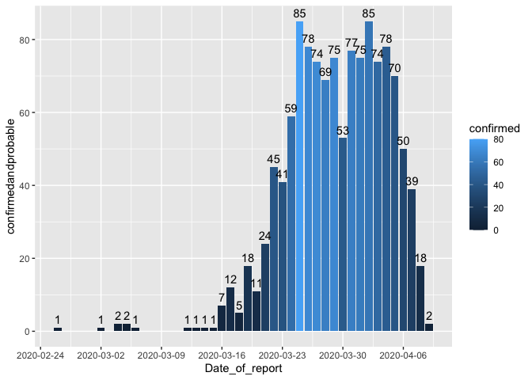
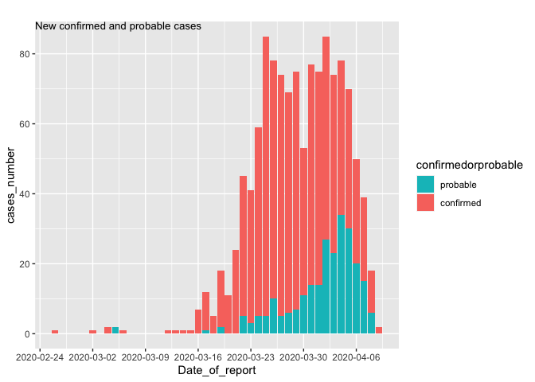
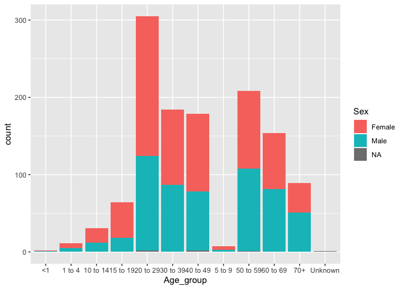
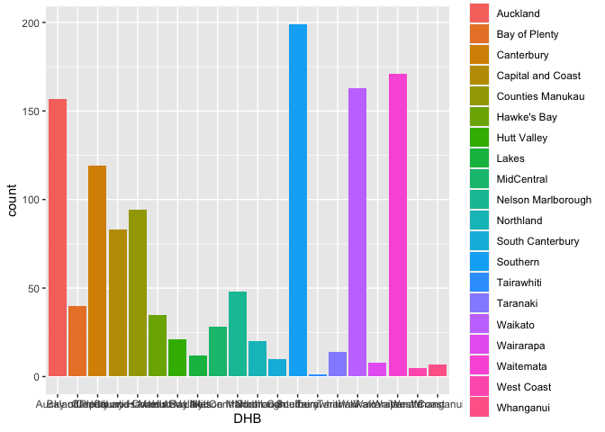
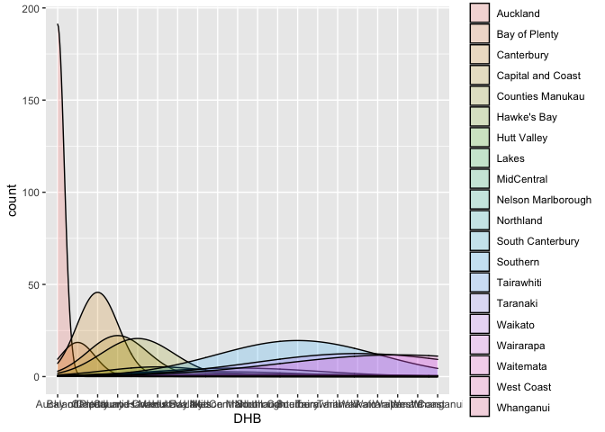
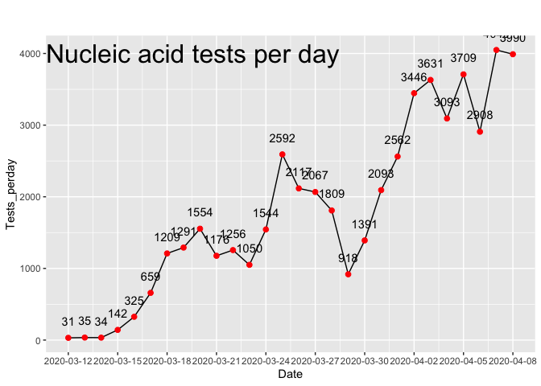
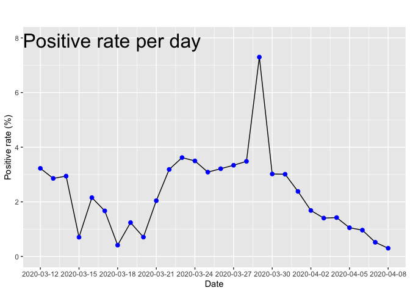

NZ covid19 visualization practice
================
Renji
May 21, 2020

**Data Visulization Practice during Lockdown**

\#\#Load packages

``` r
library(readxl)
library(tidyverse)
library(plyr)
library(reshape2)
library(dplyr)
```

\#\#Read data

``` r
april8 <- read_excel("covid-casedetails-9april2020.xlsx")
data <- april8 %>% mutate(Date_of_report = as.Date(Date_of_report), Sex = factor(Sex), Age_group = factor(Age_group))
```

\#\#Calculate confirm cases and probably cases each
day

``` r
number_confirm <- ddply(data, "Date_of_report", summarise, confirmed=sum(Confirmed), probable=sum(Probable), confirmedandprobable=sum(Confirmed)+sum(Probable))
select <- dplyr::select 
```

\#\#Use reshape to make
category

``` r
new_confirm_table <- number_confirm %>% select(-confirmedandprobable) %>% melt(id.vars = "Date_of_report", variable.name = "confirmedorprobable", value.name = "cases_number")
head(new_confirm_table)
```

    ##   Date_of_report confirmedorprobable cases_number
    ## 1     2020-02-26           confirmed            1
    ## 2     2020-03-02           confirmed            1
    ## 3     2020-03-04           confirmed            2
    ## 4     2020-03-05           confirmed            0
    ## 5     2020-03-06           confirmed            1
    ## 6     2020-03-12           confirmed            1

\#\#Barchart of each day
cases

``` r
number_confirm %>% ggplot(aes(x=Date_of_report, y=confirmedandprobable, fill=confirmed)) + geom_bar(stat = "identity") + geom_text(aes(label=confirmedandprobable, vjust=-0.5)) + scale_x_date(date_breaks = "1 week")
```

<!-- -->

``` r
p1 <- new_confirm_table %>% ggplot(aes(x=Date_of_report, y=cases_number, fill=confirmedorprobable)) + geom_bar(stat = "identity") + scale_x_date(date_breaks = "1 week") + guides(fill=guide_legend(reverse=TRUE)) 
p1 + ggtitle("New confirmed and probable cases") + theme(plot.title = element_text(size=10, vjust = -6))
```

<!-- -->

\#\#Barchart of age and
sex

``` r
data %>% select(Sex, Age_group) %>% mutate(Sex = reorder(Sex, Age_group)) %>% ggplot(aes(Age_group, fill=Sex)) + geom_bar()
```

    ## Warning in mean.default(X[[i]], ...): argument is not numeric or logical:
    ## returning NA
    
    ## Warning in mean.default(X[[i]], ...): argument is not numeric or logical:
    ## returning NA

<!-- -->

\#\#Total cases by
DHB

``` r
data %>% ggplot(aes(DHB, fill=DHB)) + geom_bar()
```

<!-- -->

``` r
data %>% ggplot(aes(DHB, y=..count.., fill=DHB)) + geom_density(alpha=0.2)
```

    ## Warning: Groups with fewer than two data points have been dropped.

<!-- -->

\#\#Positive rate

``` r
positive_rate_2 <- read_excel("positive rate_2.xlsx")
positive_rate_table <- positive_rate_2 %>% mutate(Date=as.Date(Date), Tests_perday = `Tests per Day`, positive_rate = `Positive rate`)
p2 <- positive_rate_table %>% ggplot(aes(x=Date, y=Tests_perday)) + geom_line(stat = "identity") + geom_point(size=2, color="red") + geom_text(aes(label=Tests_perday, vjust=-1.5))
p2 + scale_x_date(date_breaks = "3 day") + ggtitle("Nucleic acid tests per day") + theme(plot.title = element_text(size=24, vjust = -6))
```

<!-- -->

``` r
p3 <- positive_rate_table %>% ggplot(aes(x=Date, y=positive_rate * 100)) + geom_line(stat = "identity") + geom_point(size=2, color="blue") 
p3 + ylim(0, 8) + scale_x_date(date_breaks = "3 day") + ylab("Positive rate (%)") + ggtitle("Positive rate per day") + theme(plot.title = element_text(size=24, vjust = -6))
```

<!-- -->
